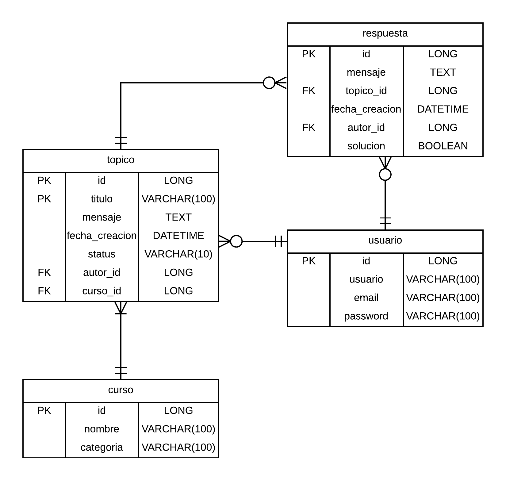

# Foro Hub API REST 📝💻

Este proyecto es una API REST desarrollada durante el curso ONE (Oracle Next Education) para finalizar la formación de Spring Boot y aplicar los conocimientos en un caso práctico. \
La API tiene objetivo permitir gestionar un foro en el que los usuarios pueden crear y resolver tópicos relacionados con diversos cursos, principalmente para la resolución de dudas sobre los mismos (muy similar al que ofrece Alura durante el cursado de ONE). \
La aplicación sigue las mejores prácticas del modelo REST e implementa funcionalidades completas de CRUD (Crear, Leer, Actualizar y Eliminar) para tópicos, además de autenticación y autorización para proteger el acceso a los recursos.

## Tabla de Contenidos 📚

- [Descripción](#descripción)
- [Características](#características)
- [Requisitos Previos](#requisitos-previos)
- [Tecnologías Utilizadas](#tecnologías-utilizadas)
- [Instalación y Configuración](#instalación-y-configuración)
- [Endpoints](#endpoints)
- [Estructura de Datos](#estructura-de-datos)
- [Autenticación y Autorización](#autenticación-y-autorización)
- [Documentación](#documentación)
- [Contribuciones](#contribuciones)

---

## Descripción 💡

Foro Hub permite a los usuarios:

- Crear y gestionar tópicos relacionados con dudas surgidas sobre cursos en específico.
- Responder a los tópicos creados por otros usuarios.
- El autor de un tópico puede marcar una respuesta de otro usuario como solución a su problema y así cerrar el tópico.

## Características ✨

1. **CRUD completo para tópicos**: Crear, leer, actualizar y eliminar tópicos.
2. **Gestión de respuestas**: Crear, editar, eliminar y marcar respuestas como solución.
3. **Autenticación y autorización**: Implementada con JWT y Auth0 para proteger los recursos.
4. **Persistencia de datos**: Base de datos MySQL con migraciones gestionadas por Flyway.
5. **Cumplimiento del modelo REST**: Estructura de rutas y prácticas recomendadas.

## Requisitos Previos ✅

- **Java**: Versión 17 o superior.
- **Maven**: Para gestionar las dependencias.
- **MySQL**: Como base de datos.
- **IntelliJ IDEA** (opcional): IDE recomendado para trabajar con Spring Boot.

## Instalación y Configuración ⚙️🔧

1. **Clonar el repositorio**:
   ```bash
   git clone https://github.com/LucianoNicolasArrieta/challenge-foro-hub.git
   cd challenge-foro-hub
   ```
2. **Configurar la base de datos**:
   - Crear una base de datos en MySQL. 
   - Actualizar las credenciales de conexión en el archivo `application.properties`. O utilizando variables de entorno:
   ```properties
   spring.datasource.url=jdbc:mysql://localhost:3306/foro_hub_api
   spring.datasource.username=tu_usuario
   spring.datasource.password=tu_contraseña
   ```
3. **Ejecutar migraciones de Flyway**:
   ```bash
   mvn flyway:migrate
   ```
4. **Ejecutar la aplicación**:
   ```bash
   mvn spring-boot:run
   ```
5. **Probar la API**:
   Usar herramientas como [Postman](https://www.postman.com/) o [Insomnia](https://insomnia.rest/) para interactuar con los endpoints.

## Tecnologías Utilizadas 🛠️

- **Java 17**
- **Spring Boot** (Spring Web, Spring Data, Spring Security)
- **MySQL**
- **JPA Hibernate**
- **Flyway Migrations**
- **JWT y Auth0**
- **Postman** (para pruebas manuales)

## Endpoints 🔗📄

### Autenticación

- **POST** `/registro`: Registrar un nuevo usuario.
- **POST** `/login`: Autenticar un usuario y obtener un token JWT.

### Cursos

- **POST** `/cursos`: Registrar un nuevo curso.
- **GET** `/cursos`: Listar todos los cursos.

### Tópicos

- **POST** `/topicos`: Crear un nuevo tópico.
- **GET** `/topicos`: Listar todos los tópicos.
- **GET** `/topicos/{id}`: Ver los detalles de un tópico específico.
- **PUT** `/topicos/{id}`: Actualizar un tópico.
- **DELETE** `/topicos/{id}`: Eliminar un tópico.

### Respuestas

- **POST** `/respuestas`: Crear una respuesta para un tópico.
- **GET** `/respuestas/?topico={id}`: Listar las respuestas de un tópico.
- **PUT** `/respuestas/{id}`: Editar una respuesta.
- **DELETE** `/respuestas/{id}`: Eliminar una respuesta.
- **PATCH** `/respuestas/{id}`: Marcar una respuesta como solución.

## Estructura de Datos 🗂️🛢️



## Autenticación y Autorización 🔒

- **Auth0 y JWT**: Se utiliza para autenticar usuarios y proteger los endpoints.
- **Roles y permisos**: Solo usuarios autenticados pueden interactuar con los recursos.

## Documentación 📖

La API cuenta con documentación generada automáticamente mediante **Spring Doc** y **Swagger**. Para visualizarla:

- Accede a la ruta `/swagger-ui.html` después de iniciar la aplicación.

La documentación incluye detalles sobre todos los endpoints, parámetros requeridos y posibles respuestas.

---

¡Gracias por tu tomarte un tiempo en ver este proyecto! ⭐😊
